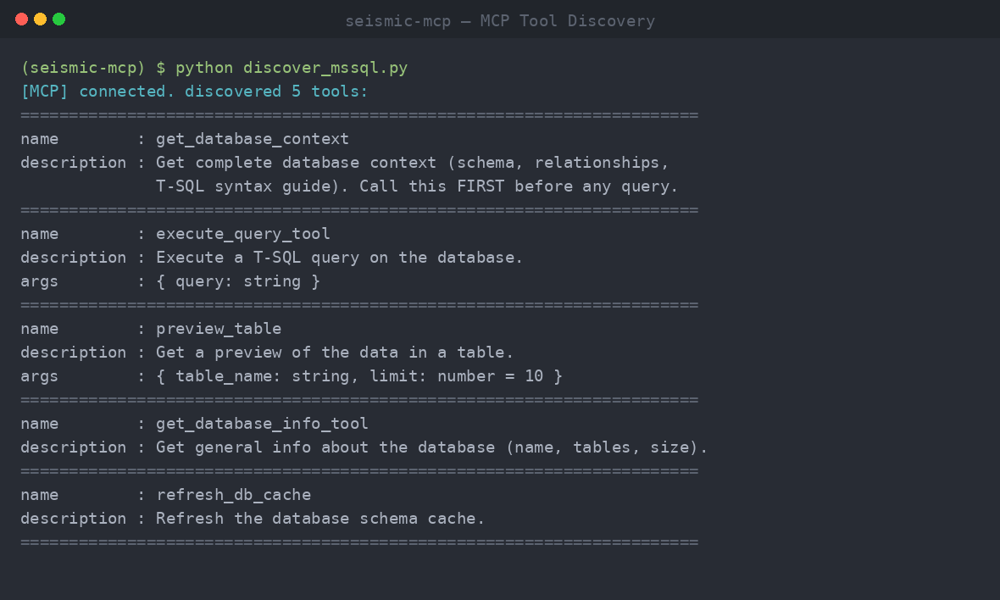
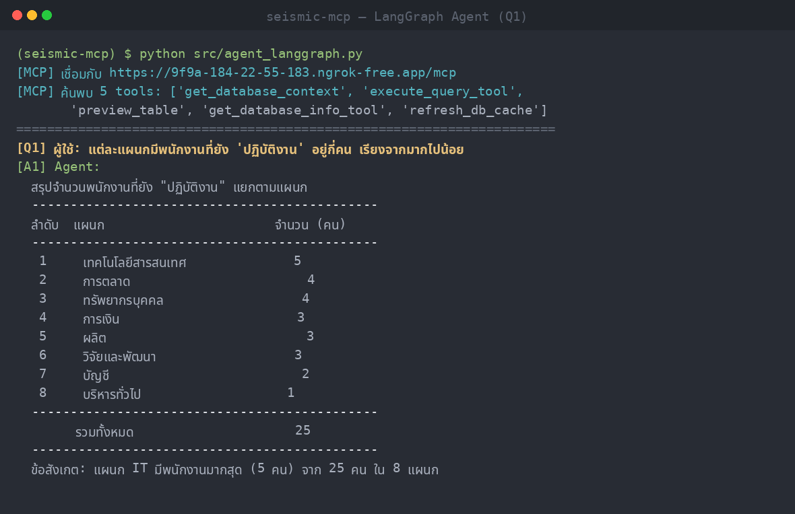

# Python-Agent-LangGraph

> หลักสูตร **Agentic AI Development with Python (หลักสูตรที่ 2)** —
> เขียน Agent ด้วย Pure Python ทีละขั้น (Lab 1–7) แล้วเปรียบเทียบกับ LangGraph (Lab 8) ก่อน deploy เป็น API Service (Lab 9)

repo นี้เป็นชุดแล็บ **9 Lab** ที่ต่อเนื่องกัน สอนตั้งแต่เรียก LLM ครั้งแรก จนถึง deploy Agent เป็น API + Docker
ทุก Lab เชื่อมกับ **MCP MSSQL Server จริง** ของหลักสูตรที่ 1 เป็นแกนข้อมูลเดียวกัน

---

## เอกสารในโปรเจกต์นี้ต่างกันอย่างไร (อ่านไฟล์ไหนก่อน)

repo นี้มี README หลายระดับ แต่ละไฟล์ตอบคนละคำถาม — เลือกอ่านตามว่าคุณอยากรู้อะไร:

| ไฟล์ | ตอบคำถามว่า | เหมาะกับใคร |
| --- | --- | --- |
| **`README.md` (ไฟล์นี้)** | "โปรเจกต์นี้คืออะไร ติดตั้งยังไง โครงสร้าง repo เป็นแบบไหน" — ภาพรวมระดับ repo + จุดเริ่มต้น | คนเปิด repo ครั้งแรก |
| [`labs/README.md`](labs/README.md) | "หลักสูตรมีกี่ Lab เรียงยังไง **เส้นทางการเรียนรู้** ไล่จาก Lab 1 ถึง 9 อย่างไร" — สารบัญ + เส้นเรื่องการสอน | ผู้เรียน/ผู้สอนที่จะเดินตามหลักสูตร |
| `labs/labN_*/README.md` | "Lab นี้มีจุดประสงค์อะไร รันยังไง โค้ดจุดสำคัญอยู่ตรงไหน" — รายละเอียดเชิงลึกราย Lab | คนที่กำลังทำ Lab นั้นอยู่ |

> สรุปสั้น: **ไฟล์นี้ = ประตูหน้าระดับ repo** (setup + โครงสร้าง) · **`labs/README.md` = สารบัญ + เส้นเรื่องหลักสูตร** · **README ราย Lab = คู่มือลงมือทำของแต่ละ Lab**

---

## เริ่มต้น (Clone Repository)

```bash
git clone https://github.com/aekanun2020/Python-Agent-LangGraph.git
cd Python-Agent-LangGraph
```

> **Setup สภาพแวดล้อมเต็มรูปแบบ (conda env + `.env` + dependencies) อยู่ที่ [Lab 1](labs/lab1_setup/README.md)** — เป็นแหล่งเดียว (single source) ทำครั้งเดียวก่อนเริ่มทำ Lab อื่นทั้งหมด
> (ดูสรุปแบบย่อในหัวข้อ [การติดตั้งและการรัน](#การติดตั้งและการรัน) ด้านล่าง ส่วนรายละเอียดครบอยู่ใน Lab 1)

---

## ภาพรวมหลักสูตร (Lab 1–9)

Lab 1–7 สอน "เขียน Agent ด้วย Pure Python เอง" (while loop + model + tools) ทีละขั้น
จนเข้าใจกลไกเบื้องหลังทั้งหมด → Lab 8 ทำสิ่งเดียวกันด้วย **LangGraph** เพื่อเทียบว่า framework ลดโค้ดส่วนไหน
→ Lab 9 นำ Agent ไป deploy เป็น API + Docker

```
Lab 1  ตรวจสภาพแวดล้อม (LLM + MCP)                 ← Setup เต็มอยู่ที่นี่
Lab 2  เรียก LLM ครั้งแรก + เทียบโมเดล
Lab 3  agent loop แรก (Pure Python)
  └─ Lab 4  + MCP MSSQL จริง (แทน local tools)
       └─ Lab 5  + Skill routing (Progressive Disclosure)
            └─ Lab 6  + TodoWrite (วางแผนงานหลายขั้น)
                 └─ Lab 7  + Memory + Compaction + Note-taking
                      └─ Lab 8  = ทุกอย่างข้างบน แต่เขียนด้วย LangGraph   ← pivot
                           └─ Lab 9  = ห่อ Lab 8 เป็น FastAPI API + Docker
```

> รายละเอียดของแต่ละ Lab และ **เส้นทางการเรียนรู้แบบเต็ม** (ผู้เรียนได้อะไรตามลำดับ) อยู่ใน [`labs/README.md`](labs/README.md)

---

## โดเมน: MCP MSSQL Server จริง (TestDB)

ต่อยอดจากหลักสูตรที่ 1 (Implementing MCP Server) โดยเปลี่ยนจาก *การใช้* MCP ผ่าน Claude Desktop/LangFlow
มาเป็น *การเขียน* Agent ด้วย Pure Python + LangGraph ที่เรียกใช้ MCP Server เดียวกัน

ทุก Lab (ตั้งแต่ Lab 4 เป็นต้นไป) เชื่อมกับ **MCP MSSQL Server จริง** ของหลักสูตรที่ 1 ที่เปิดในเครื่องแล้ว expose ผ่าน ngrok
ฐานข้อมูลที่ทดสอบคือ **TestDB** (Microsoft SQL Server 2022, 16 ตาราง, โดเมน HR) มี LLM provider เป็น **OpenRouter** (แนวคิด thin client เดียวกับหลักสูตรที่ 1)

MCP Server ให้บริการ 5 tools ที่ Agent ค้นพบอัตโนมัติ:

| Tool | หน้าที่ |
| --- | --- |
| `get_database_context` | คืน schema ทั้งหมด + ความสัมพันธ์ + คู่มือ T-SQL (เรียกก่อนเสมอ) |
| `execute_query_tool` | รันคำสั่ง T-SQL บนฐานข้อมูล |
| `preview_table` | แสดงตัวอย่างข้อมูลในตาราง |
| `get_database_info_tool` | ข้อมูลทั่วไปของฐานข้อมูล (ชื่อ จำนวนตาราง ขนาด เวอร์ชัน) |
| `refresh_db_cache` | รีเฟรช cache ของ schema |

> Agent จะ "วางแผนเอง": เรียก `get_database_context` ดู schema ก่อน → เขียน T-SQL (ใช้ `TOP` ไม่ใช่ `LIMIT`) → ส่งให้ `execute_query_tool` → สรุปผลเชิงธุรกิจเป็นภาษาไทย

---

## โครงสร้างโปรเจกต์

```
Python-Agent-LangGraph/
├── README.md                   # ไฟล์นี้ — ภาพรวมระดับ repo + setup
├── labs/
│   ├── README.md               # สารบัญ Lab 1–9 + เส้นทางการเรียนรู้
│   ├── core/                   # โค้ดกลางที่ทุก Lab ใช้ร่วมกัน (config/llm/mcp_client/registry)
│   ├── lab1_setup/             # Lab 1: ตรวจสภาพแวดล้อม (เจ้าของ Setup เต็ม)
│   ├── lab2_llm/               # Lab 2: เรียก LLM + เทียบโมเดล
│   ├── lab3_agent_loop/        # Lab 3: agent loop แรก (Pure Python)
│   ├── lab4_mcp_agent/         # Lab 4: + MCP MSSQL จริง
│   ├── lab5_skills/            # Lab 5: + Skill routing (มีโฟลเดอร์ skills/)
│   ├── lab6_todo/              # Lab 6: + TodoWrite
│   ├── lab7_memory/            # Lab 7: + Memory/Compaction/Note-taking
│   ├── lab8_langgraph/         # Lab 8: LangGraph Agent (pivot — เทียบ Pure Python)
│   └── lab9_deploy/            # Lab 9: ห่อ agent เป็น FastAPI API + Docker
├── docker-compose.yml          # Lab 9: service agent (ชี้ MCP MSSQL จริงผ่าน .env)
├── .dockerignore
├── discover_mssql.py           # ยูทิลิตี้ตรวจการเชื่อมต่อ + list tools/args schema
├── screenshots/labs/           # ภาพหน้าจอผลการรันทดสอบจริง (Lab 1–9)
│   ├── lab1_check_env.png ... lab7_memory.png
│   ├── lab8_01_mssql_discovery.png / lab8_02_agent_q1.png / lab8_03_agent_q2.png
│   ├── lab9_api_deploy.png
│   └── layer_coverage_matrix.png   # ตารางแมป layer สถาปัตยกรรม × Lab
├── requirements.txt
├── .env.example                # เทมเพลต env (ไม่มีคีย์จริง)
├── .gitignore
└── (README.md)
```

---

## การติดตั้งและการรัน

เพื่อไม่ให้ขั้นตอนซ้ำซ้อนและคลาดเคลื่อนกันหลายที่ ไฟล์นี้**ไม่ทำซ้ำ**คำสั่ง setup/run
แต่ชี้ไปยังแหล่งจริงที่เป็นเจ้าของเนื้อหานั้นโดยตรง:

- **ติดตั้งสภาพแวดล้อม (conda env `agentic-ai` + `.env` + dependencies):** ดู [Lab 1](labs/lab1_setup/README.md)
  ซึ่งเป็น **แหล่งเดียว (single source)** — ทำครั้งเดียวก่อนเริ่มทุก Lab (พัฒนา/ทดสอบด้วย **Miniconda**, Python 3.11)
- **คำสั่งรันของแต่ละ Lab + ผลลัพธ์ที่คาดหวัง:** ดู README ของ Lab นั้นโดยตรง — เริ่มจากสารบัญใน [`labs/README.md`](labs/README.md)
- **(ตัวเลือก) ตรวจการเชื่อมต่อ MCP + ดู tools ที่ค้นพบ:** `python discover_mssql.py`

> ⚠️ ไฟล์ `.env` ถูก `gitignore` ไว้แล้ว — **ห้าม commit คีย์จริงขึ้น repo เด็ดขาด**

---

## ตัวอย่างผลการรันทดสอบ — Lab 8 (LangGraph + MCP MSSQL จริง)

### ทำไมยก Lab 8 มาไว้ที่หน้าแรกของ repo

หน้าแรกของ repo ควรพิสูจน์ "ผลลัพธ์ที่สำคัญที่สุด" ให้คนเปิดดูครั้งแรกเห็นทันทีว่าโปรเจกต์นี้ทำอะไรได้จริง
**Lab 8 คือจุดที่รวมทุกอย่างของหลักสูตรเข้าด้วยกัน** จึงเป็นตัวแทนที่ดีที่สุดของทั้ง repo:

- เป็น **จุด pivot ของหลักสูตร** (Pure Python Lab 1–7 → LangGraph) — หัวใจของ Module 3 (บท 3.1–3.2)
- เป็น Lab ที่ Agent **ครบองค์ประกอบ**: ค้นพบ MCP tools เอง → วางแผนเรียก tool → เขียน T-SQL → สรุปผลธุรกิจ พร้อม Checkpointer จำ context ข้ามคำถาม
- เป็น **ฐานที่ Lab 9 นำไป deploy** ต่อ — ถ้า Lab 8 ทำงานได้จริง ก็การันตีว่าแกนของทั้งหลักสูตรทำงานได้
- screenshot ด้านล่างเป็น **ผลรันจริงกับ MCP MSSQL Server จริง** (ไม่ใช่ mock) จึงเหมาะใช้เป็นหลักฐานหน้า repo

> ผลรันของ Lab อื่น (1, 3–7, 9) ไม่ได้หายไป — อยู่ในโฟลเดอร์ `screenshots/labs/` และอ้างถึงใน README ของแต่ละ Lab ตามบริบทของมัน
> ส่วนนี้ตั้งใจโชว์เฉพาะ Lab 8 เพื่อไม่ให้หน้าแรกยาวเกินจำเป็น

องค์ประกอบ LangGraph ที่สาธิต:

| องค์ประกอบ | ในโค้ดนี้ |
| --- | --- |
| **State** | `AgentState(messages)` — สถานะที่ไหลผ่านทุก node ใช้ `add_messages` reducer |
| **Node** | `call_model` (เรียก LLM) และ `tools` (`ToolNode` รัน MCP tools) |
| **Edge** | `START → call_model`, conditional edge ตามว่ามี `tool_calls` หรือไม่, `tools → call_model` (วนกลับ) |
| **Checkpointer** | `MemorySaver` — จำ context ข้ามคำถามใน thread เดียวกัน |
| **MCP Tool Discovery** | ค้นพบ tools อัตโนมัติจาก MCP Server ผ่าน Streamable HTTP |

### 1. MCP Tool Discovery — ค้นพบ 5 tools จาก MCP MSSQL Server จริง


### 2. Business Question 1 — จำนวนพนักงานที่ปฏิบัติงานแยกตามแผนก


### 3. Business Question 2 — Top-5 พนักงานตามมูลค่าโครงการรวม (+ Checkpointer)


> Agent วางแผนเรียก tool เอง (context → query → สรุป) และ `Checkpointer` (`MemorySaver`) จำ context ข้ามคำถามใน thread เดียวกันได้จริง

---

## สลับไปยัง MCP Server อื่นได้โดยไม่ต้องแก้โค้ด

เนื่องจาก Agent กับ Tools ถูก decouple ผ่านมาตรฐาน **MCP** ผู้เรียนสามารถชี้ Agent ไปยัง MCP Server อื่น
ได้โดยแก้แค่ค่า `MCP_SERVER_URL` ในไฟล์ `.env` — ไม่ต้องแก้โค้ด Agent เลย

---

## หมายเหตุด้านความปลอดภัย

- `.env` (คีย์จริง) ถูก `gitignore` ไว้ — repo นี้มีเฉพาะ `.env.example` ที่ไม่มีคีย์จริง
- ก่อน push ทุกครั้ง ตรวจสอบว่าไม่มีคีย์หลุดเข้าไปในไฟล์ที่ commit
