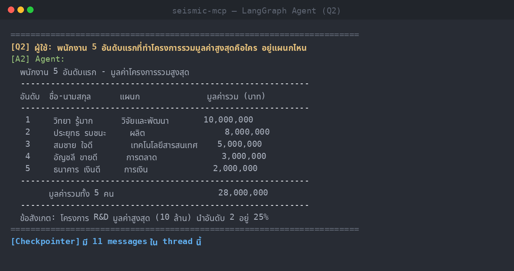

# Lab 8 — สร้าง Agent ด้วย LangGraph + MCP (MSSQL จริง)

> หลักสูตร **Agentic AI Development with Python (หลักสูตรที่ 2)** — Module 3.1
> ต่อยอดจากหลักสูตรที่ 1 (Implementing MCP Server) โดยเปลี่ยนจาก *การใช้* MCP ผ่าน Claude Desktop/LangFlow มาเป็น *การเขียน* Agent ด้วย Pure Python + LangGraph ที่เรียกใช้ MCP Server เดียวกัน

แล็บนี้สาธิตการประกอบ **LangGraph Agent** ครบทุกองค์ประกอบหลักตาม course outline และให้ Agent ค้นพบ (discover) และเรียกใช้ **MCP Tools** ของ **MCP MSSQL Server จริง** (หลักสูตรที่ 1) ผ่าน **Streamable HTTP** โดยมี **OpenRouter** เป็น LLM provider (แนวคิด thin client เดียวกับหลักสูตรที่ 1)

---

## โดเมน: MCP MSSQL Server จริง (TestDB)

Agent เชื่อมกับ **MCP MSSQL Server จริง** ของหลักสูตรที่ 1 ที่เปิดในเครื่องแล้ว expose ผ่าน ngrok ฐานข้อมูลที่ทดสอบคือ **TestDB** (Microsoft SQL Server 2022, 16 ตาราง, โดเมน HR)

MCP Server ให้บริการ 5 tools ที่ Agent ค้นพบอัตโนมัติ:

| Tool | หน้าที่ |
| --- | --- |
| `get_database_context` | คืน schema ทั้งหมด + ความสัมพันธ์ + คู่มือ T-SQL (เรียกก่อนเสมอ) |
| `execute_query_tool` | รันคำสั่ง T-SQL บนฐานข้อมูล |
| `preview_table` | แสดงตัวอย่างข้อมูลในตาราง |
| `get_database_info_tool` | ข้อมูลทั่วไปของฐานข้อมูล (ชื่อ จำนวนตาราง ขนาด เวอร์ชัน) |
| `refresh_db_cache` | รีเฟรช cache ของ schema |

> Agent จะ "วางแผนเอง": เรียก `get_database_context` ดู schema ก่อน → เขียน T-SQL (ใช้ `TOP` ไม่ใช่ `LIMIT`) → ส่งให้ `execute_query_tool` → สรุปผลเชิงธุรกิจเป็นภาษาไทย

---

## องค์ประกอบ LangGraph ที่สาธิต

| องค์ประกอบ | ในโค้ดนี้ |
| --- | --- |
| **State** | `AgentState(messages)` — สถานะที่ไหลผ่านทุก node ใช้ `add_messages` reducer |
| **Node** | `call_model` (เรียก LLM) และ `tools` (`ToolNode` รัน MCP tools) |
| **Edge** | `START → call_model`, conditional edge ตามว่ามี `tool_calls` หรือไม่, `tools → call_model` (วนกลับ) |
| **Checkpointer** | `MemorySaver` — จำ context ข้ามคำถามใน thread เดียวกัน |
| **MCP Tool Discovery** | `MultiServerMCPClient.get_tools()` ค้นพบ tools อัตโนมัติจาก MCP Server |

---

## โครงสร้างโปรเจกต์

```
Python-Agent-LangGraph/
├── src/
│   └── agent_langgraph.py      # LangGraph Agent + MCP client + OpenRouter (MSSQL จริง)
├── discover_mssql.py           # ยูทิลิตี้ตรวจการเชื่อมต่อ + list tools/args schema
├── screenshots/                # ภาพหน้าจอผลการรันทดสอบจริง
│   ├── 01_mssql_discovery.png
│   ├── 02_agent_q1.png
│   └── 03_agent_q2.png
├── requirements.txt
├── .env.example                # เทมเพลต env (ไม่มีคีย์จริง)
├── .gitignore
└── README.md
```

---

## การติดตั้ง (ใช้ Miniconda)

> แล็บนี้พัฒนาและทดสอบด้วย **Miniconda** (Python 3.11)

### 1) สร้างและเปิดใช้งาน conda environment

```bash
# สร้าง env ชื่อ seismic-mcp ด้วย Python 3.11
conda create -n seismic-mcp python=3.11 -y

# เปิดใช้งาน
conda activate seismic-mcp
```

### 2) ติดตั้ง dependencies

```bash
pip install -r requirements.txt
```

### 3) ตั้งค่า environment variables

```bash
# คัดลอกเทมเพลตแล้วใส่ค่าจริงของคุณในไฟล์ .env
cp .env.example .env
```

จากนั้นแก้ไข `.env`:

- ใส่ `OPENROUTER_API_KEY` ของคุณ (ขอคีย์ได้ที่ https://openrouter.ai/keys)
- ตั้ง `MCP_SERVER_URL` ให้ชี้ไปยัง **MCP MSSQL Server จริง** ของคุณ (เปิด MCP MSSQL ในเครื่องแล้ว expose ผ่าน ngrok เช่น `https://<subdomain>.ngrok-free.app/mcp`)

> ⚠️ ไฟล์ `.env` ถูก `gitignore` ไว้แล้ว — **ห้าม commit คีย์จริงขึ้น repo เด็ดขาด**

---

## การรันทดสอบ

> ต้องเปิด **MCP MSSQL Server จริง** ของหลักสูตรที่ 1 ไว้ และ expose ผ่าน ngrok แล้วตั้ง `MCP_SERVER_URL` ใน `.env` ให้ตรงกัน

### (ตัวเลือก) ตรวจการเชื่อมต่อ + ดู tools ที่ค้นพบ

```bash
conda activate seismic-mcp
python discover_mssql.py
```

### รัน LangGraph Agent

```bash
conda activate seismic-mcp
python src/agent_langgraph.py
```

Agent จะ:

1. ค้นพบ 5 tools จาก MCP MSSQL Server อัตโนมัติ (MCP Tool Discovery)
2. ตอบ **business question** โดยเรียก `get_database_context` ดู schema → เขียน T-SQL → ส่งให้ `execute_query_tool` เอง
3. แสดงจำนวน messages ที่ `Checkpointer` (`MemorySaver`) เก็บไว้ใน thread เดียวกัน

---

## ผลการรันทดสอบ (Screenshots)

### 1. MCP Tool Discovery — ค้นพบ 5 tools จาก MCP MSSQL Server จริง


### 2. Business Question 1 — จำนวนพนักงานที่ปฏิบัติงานแยกตามแผนก


### 3. Business Question 2 — Top-5 พนักงานตามมูลค่าโครงการรวม (+ Checkpointer)


> Agent วางแผนเรียก tool เอง (context → query → สรุป) และ `Checkpointer` เก็บ 11 messages ใน thread เดียวกัน แสดงว่าจำ context ข้ามคำถามได้จริง

---

## สลับไปยัง MCP Server อื่นได้โดยไม่ต้องแก้โค้ด

เนื่องจาก Agent กับ Tools ถูก decouple ผ่านมาตรฐาน **MCP** ผู้เรียนสามารถชี้ Agent ไปยัง MCP Server อื่นของหลักสูตรที่ 1 (เช่น RAG MCP `:8000`) ได้โดยแก้แค่ค่า `MCP_SERVER_URL` ในไฟล์ `.env` — ไม่ต้องแก้โค้ด Agent เลย

---

## หมายเหตุด้านความปลอดภัย

- `.env` (คีย์จริง) ถูก `gitignore` ไว้ — repo นี้มีเฉพาะ `.env.example` ที่ไม่มีคีย์จริง
- ก่อน push ทุกครั้ง ตรวจสอบว่าไม่มีคีย์หลุดเข้าไปในไฟล์ที่ commit
