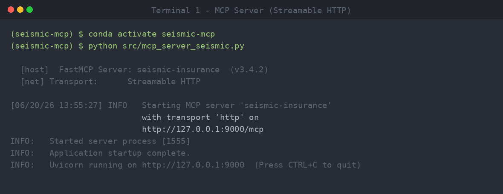
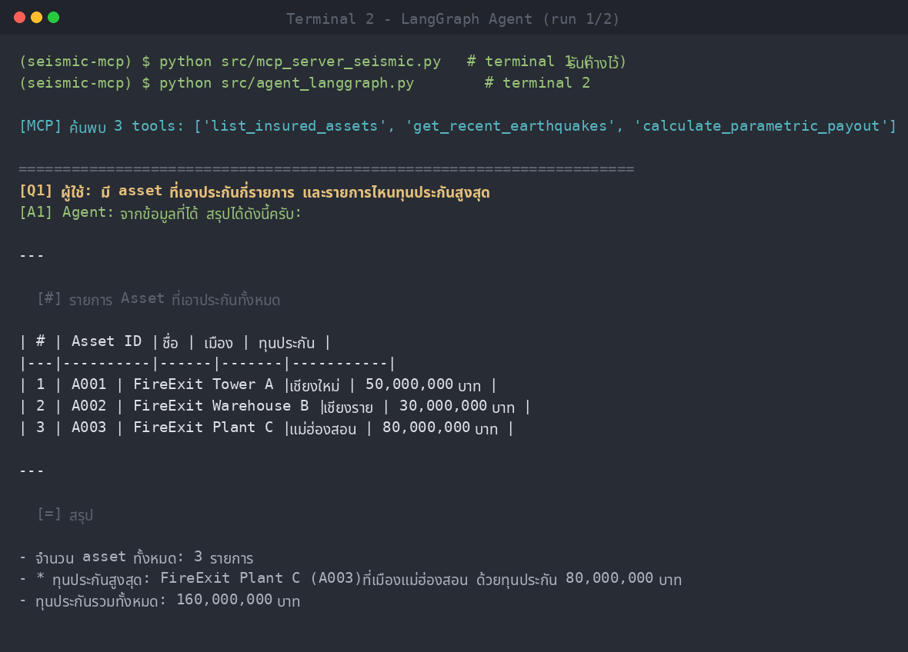
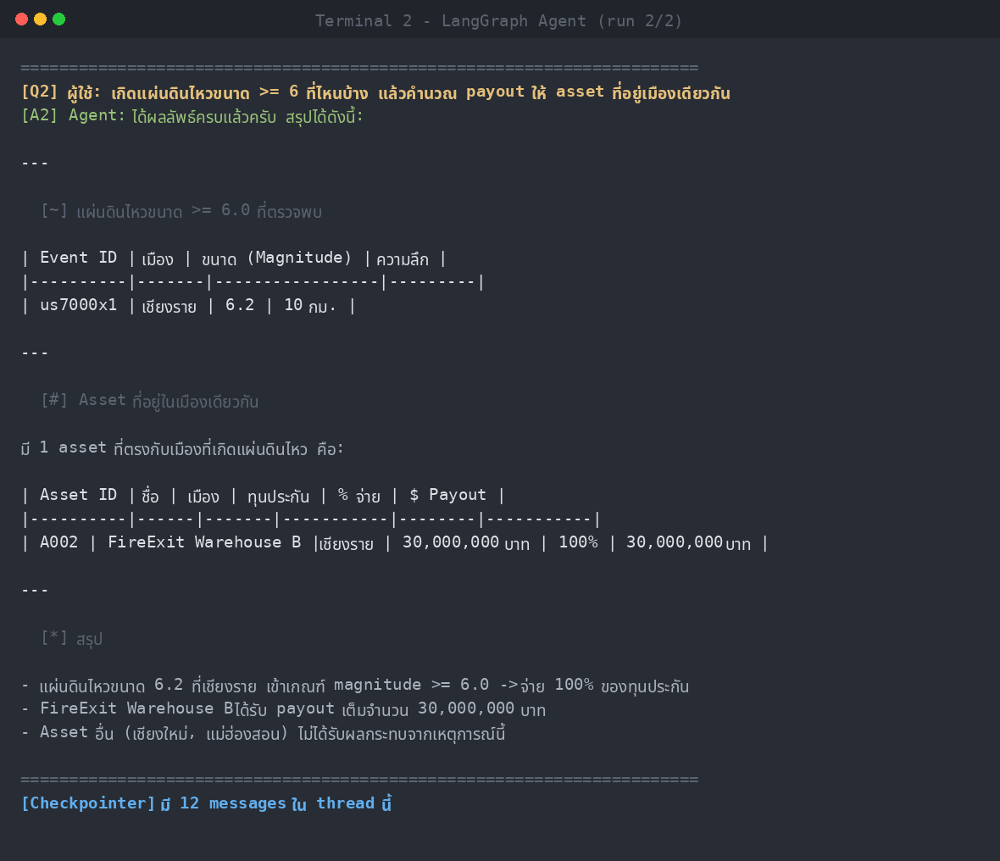

# Lab 8 — สร้าง Agent ด้วย LangGraph + MCP

> หลักสูตร **Agentic AI Development with Python (หลักสูตรที่ 2)** — Module 3.1
> ต่อยอดจากหลักสูตรที่ 1 (Implementing MCP Server) โดยเปลี่ยนจาก *การใช้* MCP ผ่าน Claude Desktop/LangFlow มาเป็น *การเขียน* Agent ด้วย Pure Python + LangGraph ที่เรียกใช้ MCP Server เดียวกัน

แล็บนี้สาธิตการประกอบ **LangGraph Agent** ครบทุกองค์ประกอบหลักตาม course outline และให้ Agent ค้นพบ (discover) และเรียกใช้ **MCP Tools** ผ่าน **Streamable HTTP** โดยมี **OpenRouter** เป็น LLM provider (แนวคิด thin client เดียวกับหลักสูตรที่ 1)

---

## โดเมนตัวอย่าง: FireExit Seismic Insurance

MCP Server จำลองโดเมนประกันภัยแผ่นดินไหว ให้บริการ 3 tools:

| Tool | หน้าที่ |
| --- | --- |
| `list_insured_assets` | คืนรายการ asset ที่เอาประกัน (จำลองแทน MSSQL ในหลักสูตรที่ 1) |
| `get_recent_earthquakes` | ดึงเหตุการณ์แผ่นดินไหวล่าสุด กรองด้วยขนาดขั้นต่ำ (จำลองแทน USGS/TMD) |
| `calculate_parametric_payout` | คำนวณ parametric payout จากขนาดแผ่นดินไหว |

ตารางจ่ายแบบ parametric: `mag >= 6.0 → 100%`, `>= 5.0 → 50%`, `>= 4.0 → 10%`, ต่ำกว่านั้นไม่จ่าย

---

## องค์ประกอบ LangGraph ที่สาธิต

| องค์ประกอบ | ในโค้ดนี้ |
| --- | --- |
| **State** | `AgentState(messages)` — สถานะที่ไหลผ่านทุก node ใช้ `add_messages` reducer |
| **Node** | `call_model` (เรียก LLM) และ `tools` (`ToolNode` รัน MCP tools) |
| **Edge** | `START → call_model`, conditional edge ตามว่ามี `tool_calls` หรือไม่, `tools → call_model` (วนกลับ) |
| **Checkpointer** | `MemorySaver` — จำ context ข้ามคำถามใน thread เดียวกัน |
| **MCP Tool Discovery** | `MultiServerMCPClient.get_tools()` ค้นพบ tools อัตโนมัติจาก MCP Server |

---

## โครงสร้างโปรเจกต์

```
Python-Agent-LangGraph/
├── src/
│   ├── mcp_server_seismic.py   # MCP Server (FastMCP, Streamable HTTP, port 9000)
│   └── agent_langgraph.py      # LangGraph Agent + MCP client + OpenRouter
├── screenshots/                # ภาพหน้าจอผลการรันทดสอบจริง
│   ├── 01_mcp_server_running.png
│   ├── 02_agent_run_q1.png
│   └── 03_agent_run_q2.png
├── requirements.txt
├── .env.example                # เทมเพลต env (ไม่มีคีย์จริง)
├── .gitignore
└── README.md
```

---

## การติดตั้ง (ใช้ Miniconda)

> แล็บนี้พัฒนาและทดสอบด้วย **Miniconda** (Python 3.11)

### 1) สร้างและเปิดใช้งาน conda environment

```bash
# สร้าง env ชื่อ seismic-mcp ด้วย Python 3.11
conda create -n seismic-mcp python=3.11 -y

# เปิดใช้งาน
conda activate seismic-mcp
```

### 2) ติดตั้ง dependencies

```bash
pip install -r requirements.txt
```

### 3) ตั้งค่า environment variables

```bash
# คัดลอกเทมเพลตแล้วใส่ค่าจริงของคุณในไฟล์ .env
cp .env.example .env
```

จากนั้นแก้ไข `.env` ใส่ `OPENROUTER_API_KEY` ของคุณ (ขอคีย์ได้ที่ https://openrouter.ai/keys)

> ⚠️ ไฟล์ `.env` ถูก `gitignore` ไว้แล้ว — **ห้าม commit คีย์จริงขึ้น repo เด็ดขาด**

---

## การรันทดสอบ

ต้องเปิด **2 เทอร์มินัล** (ทั้งคู่ activate env `seismic-mcp`)

### เทอร์มินัลที่ 1 — รัน MCP Server

```bash
conda activate seismic-mcp
python src/mcp_server_seismic.py
```

จะเห็น FastMCP เริ่มทำงานที่ `http://127.0.0.1:9000/mcp`

### เทอร์มินัลที่ 2 — รัน LangGraph Agent

```bash
conda activate seismic-mcp
python src/agent_langgraph.py
```

Agent จะ:
1. ค้นพบ 3 tools จาก MCP Server อัตโนมัติ
2. ตอบคำถามที่ต้องใช้หลาย tool ต่อเนื่องกัน (asset → earthquake → payout)
3. แสดงจำนวน messages ที่ `Checkpointer` เก็บไว้ใน thread

---

## ผลการรันทดสอบ (Screenshots)

### 1. MCP Server ทำงาน (Streamable HTTP)


### 2. Agent ตอบคำถามที่ 1 — รายการ asset และทุนประกันสูงสุด


### 3. Agent ตอบคำถามที่ 2 — คำนวณ payout จากแผ่นดินไหว (multi-step tool calls)


---

## เชื่อมต่อกับ MCP Server จริงของหลักสูตรที่ 1

โปรเจกต์นี้ใช้ MCP Server จำลองเพื่อให้รันทดสอบได้ในเครื่องเดียว แต่ผู้เรียนสามารถชี้ Agent
ไปยัง MCP Server จริงจากหลักสูตรที่ 1 (เช่น MSSQL `:9000`, RAG `:8000`) ได้โดยแก้ค่า
`MCP_SERVER_URL` ในไฟล์ `.env` โดยไม่ต้องแก้โค้ด Agent เลย — แสดงให้เห็นว่า Agent กับ Tools
ถูก decouple ผ่านมาตรฐาน MCP

---

## หมายเหตุด้านความปลอดภัย

- `.env` (คีย์จริง) ถูก `gitignore` ไว้ — repo นี้มีเฉพาะ `.env.example` ที่ไม่มีคีย์จริง
- ก่อน push ทุกครั้ง ตรวจสอบว่าไม่มีคีย์หลุดเข้าไปในไฟล์ที่ commit
